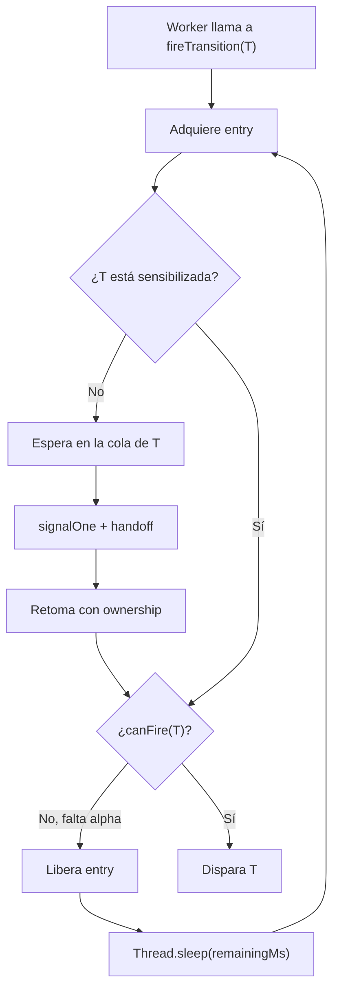

# Guía de tiempo y `TimeRestrictions`

Esta guía explica cómo se implementa el tiempo en el proyecto y cómo se conecta
`TimeRestrictions` con `Monitor`. La idea es poder seguir el código y defender
las decisiones del informe sin entrar en detalles innecesarios.

## 1. La idea central

Una transición temporizada no puede dispararse apenas se sensibiliza. Primero
debe pasar un tiempo mínimo, llamado `alpha` o EFT (*earliest firing time*).

El flujo es:

```text
la transición se sensibiliza
    ↓
se guarda el instante de sensibilización
    ↓
un worker intenta dispararla
    ↓
¿ya pasó alpha?
    ├─ no: libera el monitor, espera y reintenta
    └─ sí: permite el disparo
```

En la configuración actual, `beta` es infinito. Por eso no existe un tiempo
máximo de disparo: después de alcanzar `alpha`, la transición puede dispararse
en cualquier momento mientras continúe sensibilizada.

## 2. Conceptos mínimos

### Sensibilización

Una transición está sensibilizada cuando el marcado contiene los tokens
necesarios en sus plazas de entrada. `RdP.isSensitized(transition)` consulta esa
condición estructural.

La sensibilización no modifica el marcado. Los tokens se consumen recién cuando
la transición efectivamente se dispara.

### Ventana temporal

Si una transición se sensibiliza en el instante `enabledAt`, sus límites
temporales son:

$$
EFT = enabledAt + \alpha
$$

$$
LFT = enabledAt + \beta
$$

El intervalo general es:

$$
[EFT,LFT] = [enabledAt+\alpha, enabledAt+\beta]
$$

En el proyecto:

$$
\beta=\infty
$$

Por lo tanto, la única comprobación efectiva es:

$$
elapsed \geq \alpha
$$

### Transiciones temporizadas e inmediatas

Las transiciones temporizadas actuales son:

| Transición | `alpha` | Función |
|---|---:|---|
| `T1` | 100 ms | Paso a la sala de espera |
| `T4` | 60 ms | Finalización de la atención inferior |
| `T5` | 60 ms | Finalización de la atención superior |
| `T8` | 80 ms | Procesamiento de la cancelación |
| `T9` | 40 ms | Paso de confirmación a pago |
| `T10` | 40 ms | Finalización del pago |

Las transiciones `T0`, `T2`, `T3`, `T6`, `T7` y `T11` son inmediatas. Para ellas,
`canFire()` devuelve `true` sin consultar un reloj.

## 3. Qué guarda `TimeRestrictions`

La clase mantiene dos datos por cada transición temporizada.

### Configuración fija: `TimingConfig`

```java
private static class TimingConfig {
    private final long alphaNs;
    private final long betaNs;
}
```

Guarda los límites temporales en nanosegundos. Es información que no cambia
durante una instancia normal de la red.

### Estado de ejecución: `RuntimeState`

```java
private static class RuntimeState {
    private boolean sensitized;
    private long enabledAtNs;
}
```

Guarda el estado actual de la transición:

- `sensitized`: si está sensibilizada ahora;
- `enabledAtNs`: cuándo comenzó la habilitación temporal actual.

### Los mapas

```java
private final Map<Integer, TimingConfig> timedTransitions;
private final Map<Integer, RuntimeState> runtimeStates;
```

`timedTransitions` relaciona cada índice con su configuración. Por separado,
`runtimeStates` guarda el estado temporal que cambia durante la ejecución.

### El reloj

```java
private final LongSupplier clockNs;

clockNs = System::nanoTime;
```

`System.nanoTime()` se usa para medir duraciones. No representa la hora del día,
sino un contador monotónico apropiado para calcular tiempos transcurridos.

## 4. Configuración inicial

El constructor recibe una matriz con pares `{transición, alphaMs}`:

```java
private static final int[][] TIMED_TRANSITIONS_BASE_MS = {
    { 1, 100 }, { 4, 60 }, { 5, 60 },
    { 8, 80 }, { 9, 40 }, { 10, 40 }
};
```

`Monitor` crea el objeto así:

```java
time = new TimeRestrictions(TIMED_TRANSITIONS_BASE_MS);
```

Después, `TimeRestrictions` recorre la configuración y llama:

```java
setTimedTransition(config[0], config[1], INFINITE_BETA);
```

`setTimedTransition()` hace lo siguiente:

1. Rechaza un `alpha` negativo.
2. Rechaza un `beta` menor que `alpha`.
3. Convierte milisegundos a nanosegundos.
4. Guarda un `TimingConfig` en `timedTransitions`.
5. Crea un `RuntimeState` inicial en `runtimeStates`.

La conversión se realiza con:

```java
TimeUnit.MILLISECONDS.toNanos(alphaMs)
```

El código recibe milisegundos porque son cómodos para configurar el sistema,
pero compara en nanosegundos para medir con mayor precisión.

## 5. Cómo empieza y se actualiza una ventana

Después de cada disparo, `Monitor` actualiza el tiempo:

```java
rdp.fireTransition(firingVector);
time.refreshTimedState(rdp.getSensitized(), transition);
```

`refreshTimedState()` recorre todas las transiciones temporizadas y consulta el
vector de sensibilización producido por la RdP:

```java
public void refreshTimedState(DMatrixRMaj sensitized, int firedTransition) {
    for (int transition : timedTransitions.keySet()) {
        boolean isSensitized = sensitized.get(0, transition) == 1;
        refreshTransitionState(
            transition,
            isSensitized,
            transition == firedTransition
        );
    }
}
```

Para cada transición se calcula:

```java
boolean startsNewWindow =
    isSensitized && (wasFired || !state.sensitized);
```

La ventana comienza de nuevo en dos casos:

1. La transición estaba no sensibilizada y ahora pasó a estar sensibilizada.
2. La transición acaba de dispararse y continúa sensibilizada.

Si la transición sigue sensibilizada sin dispararse, conserva su reloj anterior.

| Estado anterior | Estado actual | ¿Se disparó? | Acción |
|---|---|---:|---|
| No sensibilizada | Sensibilizada | No | Registrar nuevo `enabledAtNs` |
| Sensibilizada | Sensibilizada | No | Conservar el reloj |
| Sensibilizada | Sensibilizada | Sí | Reiniciar el reloj |
| Sensibilizada | No sensibilizada | No | Cerrar la habilitación |
| No sensibilizada | No sensibilizada | No | No hacer nada |

El método que aplica la actualización es:

```java
private void refreshTransitionState(
    int transition,
    boolean isSensitized,
    boolean wasFired
) {
    RuntimeState state = runtimeStates.get(transition);
    boolean startsNewWindow =
        isSensitized && (wasFired || !state.sensitized);

    state.sensitized = isSensitized;
    if (startsNewWindow) {
        state.enabledAtNs = clockNs.getAsLong();
    }
}
```

La idea importante es esta:

> Una sensibilización persistente conserva el instante inicial. No se reinicia
> `alpha` cada vez que un worker pregunta si puede disparar.

## 6. Cómo decide `canFire()`

El método central es:

```java
public boolean canFire(int transition) throws InterruptedException {
    if (!isTimedTransition(transition)) {
        return true;
    }

    RuntimeState state = runtimeStates.get(transition);
    if (!state.sensitized) {
        throw new IllegalStateException();
    }

    TimingConfig config = timedTransitions.get(transition);
    long elapsed = clockNs.getAsLong() - state.enabledAtNs;

    return elapsed >= config.alphaNs;
}
```

Se puede leer así:

1. Si la transición es inmediata, permitir el disparo.
2. Si es temporizada pero no está sensibilizada, el estado es inconsistente y
   se lanza una excepción.
3. Calcular cuánto tiempo pasó desde `enabledAtNs`.
4. Compararlo con `alphaNs`.

El resultado es:

| Resultado | Significado |
|---|---|
| `true` | Ya se alcanzó el EFT, puede disparar |
| `false` | Todavía es demasiado temprano |

`canFire()` no consume tokens ni cambia la red. Sólo consulta el tiempo.

## 7. Cómo calcula el tiempo restante

Si el worker todavía no puede disparar, `Monitor` llama a:

```java
time.awaitUntilEFT(transition);
```

Primero se calcula el tiempo pendiente:

```java
public long getRemainingToEFT(int transition) {
    if (!isTimedTransition(transition)) {
        return 0L;
    }

    RuntimeState state = runtimeStates.get(transition);
    if (!state.sensitized) {
        return 0L;
    }

    TimingConfig config = timedTransitions.get(transition);
    long elapsed = clockNs.getAsLong() - state.enabledAtNs;
    long remainingNs = Math.max(0L, config.alphaNs - elapsed);
    long remainingMs = TimeUnit.NANOSECONDS.toMillis(remainingNs);

    if (remainingNs > 0 && remainingMs == 0L) {
        return 1L;
    }

    return remainingMs;
}
```

La fórmula es:

$$
remaining = \max(0,\alpha-elapsed)
$$

La conversión de nanosegundos a milisegundos trunca la parte decimal. Por eso,
si todavía falta tiempo pero el resultado convertido da cero, el método devuelve
`1` milisegundo. Así evita terminar la espera con tiempo pendiente.

## 8. Cómo espera `awaitUntilEFT()`

El método es corto:

```java
void awaitUntilEFT(int transition) throws InterruptedException {
    long remainingMs;
    while ((remainingMs = getRemainingToEFT(transition)) > 0) {
        Thread.sleep(remainingMs);
    }
}
```

No se duerme dentro del mutex. Antes de llamarlo, `Monitor` ejecuta:

```java
ownership.release();
```

El flujo es entonces:

1. La transición está sensibilizada.
2. Todavía no pasó `alpha`.
3. El worker libera `entry`.
4. `awaitUntilEFT()` calcula el tiempo restante.
5. `Thread.sleep()` duerme ese tiempo.
6. Al despertar, vuelve al ciclo de `fireTransition`.
7. Como ya no tiene ownership, adquiere nuevamente `entry`.
8. Vuelve a comprobar la sensibilización y el tiempo.

El `while` interno vuelve a calcular el tiempo porque el scheduler puede
despertar al hilo con cierta imprecisión. No se confía ciegamente en un único
`sleep`.

## 9. Integración con `Monitor`

El flujo actual de `fireTransition()` es:

```java
while (true) {
    if (!ownership.isOwned()) {
        ownership.acquire();

        if (!rdp.isSensitized(transition)) {
            waitForSensitization(transition, ownership);
            continue;
        }
    }

    if (time.canFire(transition)) {
        fireAndReleaseTransition(transition, ownership);
        return true;
    } else {
        ownership.release();
        time.awaitUntilEFT(transition);
    }
}
```

Hay dos motivos de espera distintos:

| Situación | Espera | Cómo vuelve el worker |
|---|---|---|
| La transición no está sensibilizada | Semáforo de la cola de transición | `signalOne()` y handoff |
| Está sensibilizada, pero no alcanzó `alpha` | `Thread.sleep()` | Despierta por tiempo y vuelve a adquirir `entry` |

La espera por tiempo no agrega al worker a una cola de transición. El monitor
no lo despierta. El worker se despierta solo cuando termina el plazo de
`Thread.sleep()`.



## 10. Ejemplo con `T1`

Supongamos que `T0` dispara y deja sensibilizada a `T1`.

```text
t = 0 ms       T0 dispara
                T1 pasa a estar sensibilizada
                enabledAtNs = instante actual

t = 30 ms      el worker intenta disparar T1
                elapsed = 30 ms
                alpha = 100 ms
                canFire() = false
                libera entry y duerme aproximadamente 70 ms

t ≈ 100 ms     el worker despierta
                vuelve a adquirir entry
                canFire() = true
                T1 puede disparar
```

El instante que inicia el reloj es el momento en que `T1` se sensibiliza, no el
momento en que el worker llega a `Thread.sleep()`.

## 11. Relación con el análisis temporal del informe

Con los valores base, el camino de cancelación tiene estos tiempos mínimos:

$$
T_0+T_1+T_3+T_4+T_7+T_8+T_{11}
$$

Como `T0`, `T3`, `T7` y `T11` son inmediatas:

$$
T_C^{cancelación}=100+60+80=240\text{ ms}
$$

El camino de confirmación tiene:

$$
T_0+T_1+T_2+T_5+T_6+T_9+T_{10}+T_{11}
$$

Por lo tanto:

$$
T_C^{confirmación}=100+60+40+40=240\text{ ms}
$$

Los dos caminos tienen el mismo tiempo de ciclo mínimo en la configuración
base. El informe lo resume como:

$$
T_C=240\text{ ms}
$$

### Cuello de botella base

`T1` tiene `alpha = 100 ms` y pertenece al segmento de ingreso, que se ejecuta
con un solo worker. Por eso limita el ritmo con el que nuevos clientes entran
al pipeline. Bajo las hipótesis del análisis, el throughput máximo ideal de esa
etapa es aproximadamente un cliente cada 100 ms.

### Fórmula del tiempo total

Para `N` ejecuciones, el informe utiliza la estimación:

$$
T_{teórico}=T_C+(N-1)\times t_{bottleneck}
$$

En la corrida principal, `N` es 186. La fórmula supone que el primer cliente
recorre el ciclo completo y que los siguientes aprovechan el solapamiento de
las etapas. Es una estimación ideal, no una garantía del tiempo de pared.

### Escenarios del informe

| Escenario | Cambio | Efecto esperado |
|---|---|---|
| Base | Valores originales | `T1` domina el ingreso |
| Etapa final más lenta | `T9` y `T10` pasan a 160 ms | La confirmación se vuelve el tramo más pesado |
| Agentes más lentos | `T4` y `T5` pasan a 240 ms | La etapa de agentes desplaza a `T1` como cuello de botella |
| Cola más rápida | `T1` pasa a 50 ms | El cuello de botella se desplaza a la siguiente etapa lenta |

El análisis práctico del informe promedia cinco ejecuciones por escenario. Las
diferencias respecto de la estimación teórica provienen de la planificación de
la JVM, cambios de contexto, competencia por el mutex y coordinación entre
workers.

## 12. Qué ocurre con `beta`

`TimingConfig` tiene el campo:

```java
private final long betaNs;
```

Además, `setTimedTransition()` acepta un beta finito y valida que sea mayor o
igual que alpha. Sin embargo, `canFire()` solo compara `elapsed` con
`config.alphaNs`. No utiliza `config.betaNs`.

La configuración vigente siempre llama al constructor con:

```java
INFINITE_BETA
```

Por eso, en el código actual:

- no se detecta una expiración;
- no se desensibiliza una transición por superar beta;
- no se devuelven tokens;
- no hay disparo forzado por vencimiento.

Si se pregunta por semántica fuerte, la respuesta correcta para este proyecto
es:

> No está implementada. El proyecto usa semántica débil con beta infinito. La
> clase conserva el campo para representar la configuración, pero la lógica
> vigente solo aplica el límite inferior alpha.

## 13. Puntos para defender

### Respuesta corta

> `TimeRestrictions` mantiene una configuración y un estado por transición
> temporizada. Cuando la transición se sensibiliza, guarda el instante con
> `System.nanoTime()`. `canFire()` calcula el tiempo transcurrido y lo compara
> con alpha. Si todavía no se alcanzó, el monitor libera el mutex y el worker
> espera mediante `Thread.sleep()` en `awaitUntilEFT()`. Al despertar vuelve a
> adquirir el mutex y reintenta. Después de cada disparo se actualiza el estado
> temporal: una sensibilización persistente conserva su reloj y una nueva
> habilitación comienza otro. Como beta es infinito, no existe expiración.

### Preguntas que deberías poder responder

1. ¿Qué diferencia hay entre sensibilización estructural y habilitación temporal?
2. ¿Cuándo se guarda `enabledAtNs`?
3. ¿Por qué una sensibilización persistente no reinicia alpha?
4. ¿Qué ocurre si la transición dispara y sigue sensibilizada?
5. ¿Por qué se usa `System.nanoTime()`?
6. ¿Dónde duerme el worker que todavía no alcanzó alpha?
7. ¿Libera el mutex antes de dormir?
8. ¿Por qué `awaitUntilEFT()` usa un `while`?
9. ¿Qué diferencia hay entre esperar en la cola de una transición y esperar por alpha?
10. ¿El código actual utiliza beta?
11. ¿Cómo se obtienen los 240 ms del informe?
12. ¿Por qué `T1` es el cuello de botella de la configuración base?
