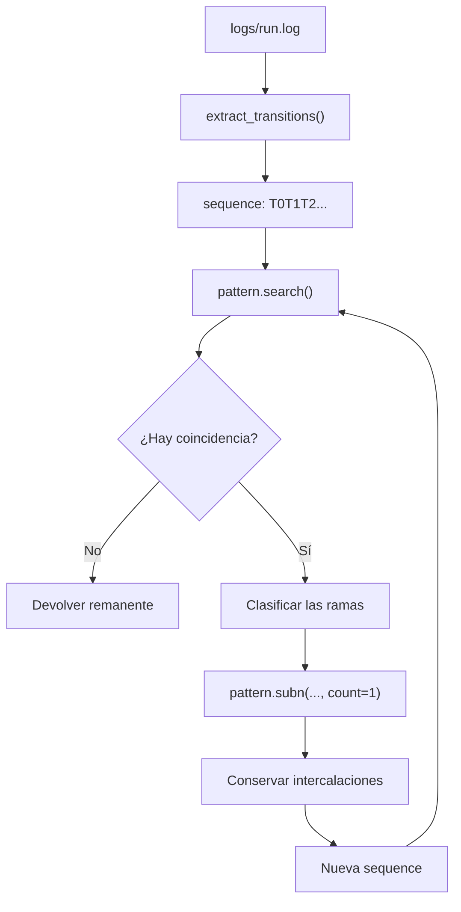
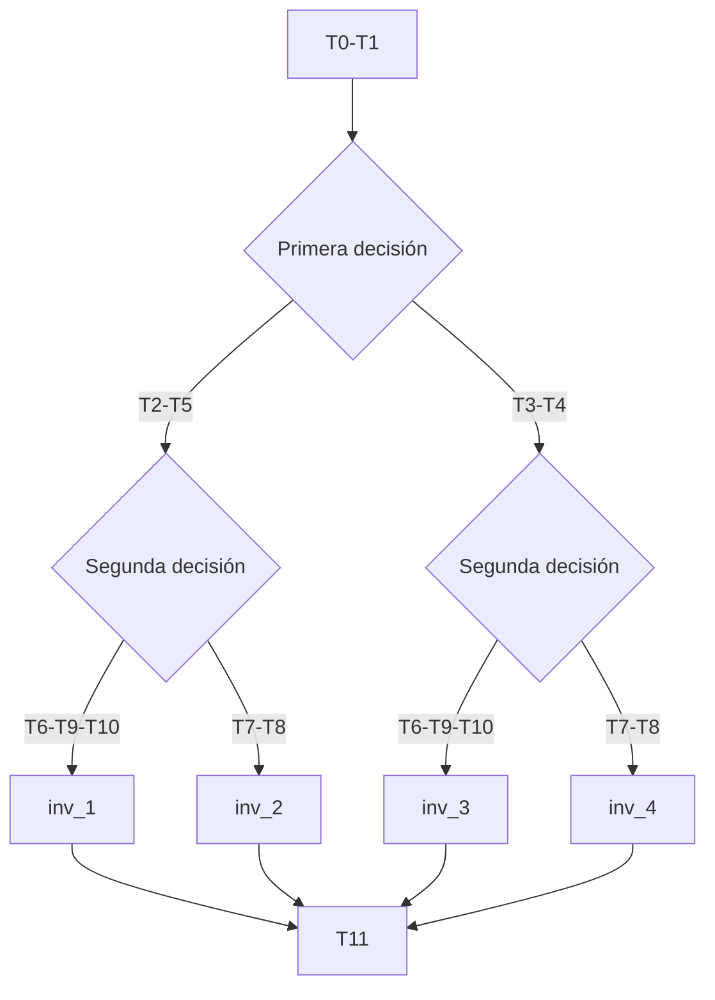
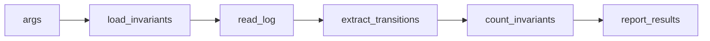

# Guía de `InvariantsAnalyzer.py`

Este script analiza la traza de disparos de la Red de Petri. Busca en el orden
real en que aparecen las transiciones cuatro secuencias compatibles con los
T-invariantes del modelo y cuenta cuántas veces encuentra cada una.

La idea central es:

> El programa extrae las transiciones del log, busca una secuencia compatible,
> la clasifica, elimina las transiciones de ese ciclo y conserva lo que estaba
> intercalado. Luego repite el proceso sobre la secuencia restante.

El script valida una traza concreta. No demuestra por sí solo que todos los
marcados de la red sean correctos, que todos los clientes se hayan identificado
ni que la red sea viva.

## 1. Modelo mental en treinta segundos

El flujo completo es:

```text
log completo
    ↓
extraer los campos tr=Tn
    ↓
concatenar las transiciones
    ↓
buscar un ciclo compatible con la regex
    ↓
clasificar la combinación de ramas
    ↓
reemplazar el ciclo por sus intercalaciones
    ↓
repetir hasta que no haya más coincidencias
    ↓
informar totales y remanente
```



La palabra **peeling** o "pelado" describe justamente la operación de sacar un
ciclo reconocido y dejar la secuencia que queda para la próxima iteración.

## 2. Las cuatro secuencias que se buscan

Todos los caminos comienzan con `T0-T1` y terminan con `T11`. Entre ambos hay
dos decisiones:

1. Primera decisión:
   - rama superior: `T2-T5`;
   - rama inferior: `T3-T4`.
2. Segunda decisión:
   - confirmación y pago: `T6-T9-T10`;
   - cancelación: `T7-T8`.

| Nombre | Primera rama | Segunda rama | Secuencia reconocida |
|---|---|---|---|
| `inv_1` | `T2-T5` | `T6-T9-T10` | `T0-T1-T2-T5-T6-T9-T10-T11` |
| `inv_2` | `T2-T5` | `T7-T8` | `T0-T1-T2-T5-T7-T8-T11` |
| `inv_3` | `T3-T4` | `T6-T9-T10` | `T0-T1-T3-T4-T6-T9-T10-T11` |
| `inv_4` | `T3-T4` | `T7-T8` | `T0-T1-T3-T4-T7-T8-T11` |

En la tabla se muestran guiones para facilitar la lectura. En el programa las
transiciones se concatenan sin separadores, por ejemplo:

```text
T0T1T2T5T7T8T11
```

La regex no exige que las transiciones estén juntas. Puede haber otras
transiciones entre ellas, porque esos fragmentos se capturan con `.*?` y luego
se conservan.



## 3. El algoritmo principal

El núcleo de `count_invariants()` puede resumirse así:

```python
pattern, replacement = build_regex()
count = 0

while True:
    match = pattern.search(sequence)

    if match is None:
        break

    # leer los grupos de match e incrementar counters

    sequence, n = pattern.subn(
        replacement,
        sequence,
        count=1
    )

    count += 1
```

En el código real, la clasificación se implementa con cuatro booleanos y se
incrementa directamente el diccionario `counters`; no existe una función
`classify()` separada. La secuencia de pasos es:

1. `search()` busca el primer match posible.
2. Los grupos de las alternativas indican qué camino se tomó.
3. Se incrementa el contador de ese tipo.
4. `subn()` reemplaza un solo match.
5. Los grupos intercalados quedan en `sequence`.
6. El bucle vuelve a empezar.

## 4. Cómo se construye la secuencia desde el log

El comando de ejecución es:

```bash
python3 regex/InvariantsAnalyzer.py \
  --log logs/run.log \
  --inv regex/TInvariants.yaml
```

Una línea del log tiene esta forma aproximada:

```text
2026-08-29 ... | thr=Thread-1 | tr=T0 | ok=true | m=[...] | pinv=OK
```

La función `read_log()` lee todo el archivo como un `str`. Luego
`extract_transitions()` busca sólo el campo `tr`:

```python
transitions = re.findall(r"\| tr=(T\d+) \|", log_text)
```

La expresión se interpreta así:

| Fragmento | Significado |
|---|---|
| `\|` | Carácter `|` literal |
| ` tr=` | Texto exacto que precede al nombre |
| `(T\d+)` | Una `T` seguida de uno o más dígitos |
| ` \|` | Espacio y otro `|` literal |

Sobre esta parte:

```text
| tr=T10 |
```

captura:

```text
T10
```

Como la expresión tiene un único grupo capturante, `findall()` devuelve una
lista de nombres:

```python
["T0", "T1", "T2", "T0", "T5", "T7", ...]
```

Después, `join()` los concatena:

```python
return "".join(transitions)
```

El resultado es una única cadena:

```text
T0T1T2T0T5T7T1T3T0T8T11...
```

Los timestamps, nombres de workers, marcados y resultados de P-invariantes no
entran en la regex principal. Sólo se conserva la secuencia de transiciones.

## 5. Estructura de la regex

La implementación utiliza este patrón, escrito en una sola línea en Python:

```python
pattern = r"(T0)(.*?)(T1)(.*?)(?:(T2)(.*?)(T5)|(T3)(.*?)(T4))(.*?)(?:(T6)(.*?)(T9)(.*?)(T10)|(T7)(.*?)(T8))(.*?)(T11)(.*?)"
```

Para leerlo mejor, se puede separar visualmente así:

```regex
(T0)(.*?)(T1)(.*?)
(?:(T2)(.*?)(T5)|(T3)(.*?)(T4))
(.*?)
(?:(T6)(.*?)(T9)(.*?)(T10)|(T7)(.*?)(T8))
(.*?)(T11)(.*?)
```

Su estructura lógica es:

```text
T0
T1
(T2 ... T5 | T3 ... T4)
(T6 ... T9 ... T10 | T7 ... T8)
T11
```

### Significado de los elementos

#### `(Tn)`

Busca una transición concreta y la captura. Por ejemplo:

```regex
(T0)
```

busca el texto `T0`.

#### `(.*?)`

Es el grupo que permite las intercalaciones:

- `.` representa cualquier carácter excepto salto de línea con la
  configuración predeterminada;
- `*` significa cero o más caracteres;
- `?` hace que la búsqueda sea no codiciosa.

Al ser no codicioso, `.*?` intenta consumir la menor cantidad posible. Si el
resto del patrón todavía no puede coincidir, el motor amplía ese grupo mediante
backtracking hasta encontrar una coincidencia válida.

En este script la cadena no contiene saltos de línea, por lo que `.*?` puede
capturar cualquier fragmento de la secuencia, incluso varias transiciones
intercaladas.

#### `(?:A|B)`

Agrupa alternativas sin crear un grupo capturante adicional:

```regex
(?:T2...T5|T3...T4)
```

Significa "buscar la rama `T2-T5` o la rama `T3-T4`". Como `?:` indica un grupo
no capturante, no cambia la numeración de los grupos posteriores.

## 6. Mapa de los grupos capturados

Los grupos se numeran de izquierda a derecha según el orden de apertura de los
paréntesis capturantes. Los grupos `(?:...)` no cuentan.

| Grupo | Contenido | Papel |
|---:|---|---|
| 1 | `T0` | Transición que inicia el ciclo |
| 2 | Intercalado entre `T0` y `T1` | Se conserva |
| 3 | `T1` | Transición común |
| 4 | Intercalado antes de la primera rama | Se conserva |
| 5 | `T2`, si se toma la rama superior | Permite clasificar |
| 6 | Intercalado entre `T2` y `T5` | Se conserva |
| 7 | `T5` | Transición de la rama superior |
| 8 | `T3`, si se toma la rama inferior | Permite clasificar |
| 9 | Intercalado entre `T3` y `T4` | Se conserva |
| 10 | `T4` | Transición de la rama inferior |
| 11 | Intercalado entre las dos decisiones | Se conserva |
| 12 | `T6`, si se confirma | Permite clasificar |
| 13 | Intercalado entre `T6` y `T9` | Se conserva |
| 14 | `T9` | Transición de confirmación |
| 15 | Intercalado entre `T9` y `T10` | Se conserva |
| 16 | `T10` | Transición de pago |
| 17 | `T7`, si se cancela | Permite clasificar |
| 18 | Intercalado entre `T7` y `T8` | Se conserva |
| 19 | `T8` | Transición de cancelación |
| 20 | Intercalado antes de `T11` | Se conserva |
| 21 | `T11` | Transición común final |
| 22 | Intercalado posterior a `T11` | Se conserva |

Si la regex toma la rama superior, el grupo 5 contiene `T2` y el grupo 8 vale
`None`. Si toma la rama inferior ocurre al revés. Lo mismo sucede con los
grupos 12 y 17 para las decisiones de confirmación y cancelación.

Por ejemplo:

```python
m.group(5)  # "T2" si tomó T2-T5; None si tomó T3-T4
m.group(8)  # "T3" si tomó T3-T4; None si tomó T2-T5
```

## 7. `search()`: encontrar un ciclo dentro de la traza

El código busca así:

```python
m = pattern.search(sequence)
```

`search()` no exige que el match comience en la posición cero. Busca desde el
inicio de la cadena hasta encontrar la primera posición desde la cual puede
completar todo el patrón.

Por ejemplo, en:

```text
T4T5T0T1T2T5T7T8T11
```

el match puede empezar en `T0`. El prefijo `T4T5` queda fuera del match y no se
modifica.

El objeto `m` permite consultar:

```python
m.group(0)   # coincidencia completa
m.group(1)   # primer grupo, T0
m.group(2)   # primer intercalado
m.groups()   # todos los grupos
```

## 8. Cómo se clasifica la coincidencia

Después de encontrar el match, el script observa los grupos que representan
alternativas:

```python
took_upper = m.group(5) is not None
took_lower = m.group(8) is not None
took_left = m.group(12) is not None
took_right = m.group(17) is not None
```

Los nombres significan:

| Variable | Grupo | Significado |
|---|---:|---|
| `took_upper` | 5 | Se tomó `T2-T5` |
| `took_lower` | 8 | Se tomó `T3-T4` |
| `took_left` | 12 | Se tomó `T6-T9-T10` |
| `took_right` | 17 | Se tomó `T7-T8` |

Luego se combinan las dos decisiones:

```python
if took_upper and took_left:
    counters["T0-T1-T2-T5 / T6-T9-T10-T11"] += 1
elif took_upper and took_right:
    counters["T0-T1-T2-T5 / T7-T8-T11"] += 1
elif took_lower and took_left:
    counters["T0-T1-T3-T4 / T6-T9-T10-T11"] += 1
elif took_lower and took_right:
    counters["T0-T1-T3-T4 / T7-T8-T11"] += 1
else:
    raise RuntimeError(...)
```

### Por qué se usa `is not None`

Cuando una alternativa no participa, sus grupos capturantes valen `None`:

```python
m.group(8) is None
```

En cambio, un grupo `(.*?)` puede haber participado y capturado una cadena
vacía:

```python
m.group(2) == ""
```

Por eso `is not None` distingue correctamente entre "esta alternativa no se
tomó" y "esta alternativa se tomó, pero no había caracteres intercalados".

## 9. `subn()`: qué hace exactamente

Ésta es la parte central del peeling.

```python
sequence, n = pattern.subn(
    replacement,
    sequence,
    count=1
)
```

`subn()` no sabe qué es una transición intercalada. Tampoco decide por sí misma
qué grupos sobreviven. El comportamiento lo define el argumento `replacement`.

### Modelo mental

Podemos imaginar la cadena así:

```text
sequence = prefijo + match + sufijo
```

`subn()` reemplaza sólo el `match`:

```text
nueva_sequence = prefijo + replacement + sufijo
```

El prefijo y el sufijo están fuera de la coincidencia, así que se conservan
automáticamente. Dentro del match sólo permanecen los grupos que se escriben en
`replacement`.

### Ejemplo mínimo

```python
pattern = re.compile(r"(T0)(.*?)(T1)")
replacement = r"\g<2>"
sequence = "XXT0T7T8T1YY"
```

Los grupos son:

```text
grupo 1 = T0
grupo 2 = T7T8
grupo 3 = T1
```

El match completo es `T0T7T8T1`. Como `replacement` contiene solamente
`\g<2>`, el resultado es:

```text
XX + T0T7T8T1 + YY
       ↓
XX +    T7T8 + YY
```

En Python:

```python
new_sequence == "XXT7T8YY"
n == 1
```

`T0` y `T1` desaparecen porque sus grupos no se incluyeron. `T7T8` sobrevive
porque el grupo 2 sí se incluyó.

### `replacement` real

El script define:

```python
replacement = (
    r"\g<2>\g<4>\g<6>\g<9>\g<11>"
    r"\g<13>\g<15>\g<18>\g<20>\g<22>"
)
```

Los grupos incluidos son todos los grupos de intercalación:

```text
2, 4, 6, 9, 11, 13, 15, 18, 20, 22
```

Los grupos omitidos son los que contienen las transiciones del ciclo:

```text
1, 3, 5, 7, 8, 10, 12, 14, 16, 17, 19, 21
```

Por lo tanto:

```text
grupos .*? incluidos en replacement  → sobreviven
grupos de transiciones omitidos      → desaparecen
```

No se trata de que `subn()` reconozca semánticamente las intercalaciones. El
programador las conservó al escribir sus referencias `\g<2>`, `\g<4>`, etc.

El reemplazo incluye referencias de las dos ramas porque los grupos de la rama
que no se tomó valen `None`. El motor de reemplazo los interpreta como texto
vacío, por lo que no agregan nada al resultado. Así, no hace falta construir un
`replacement` distinto para cada tipo de invariante.

### Qué significa `count=1`

```python
count=1
```

indica que se debe reemplazar una sola coincidencia. Así, el bucle procesa un
ciclo por iteración y puede clasificarlo individualmente.

Si no se indicara `count=1`, `subn()` intentaría reemplazar todas las
coincidencias no superpuestas en una sola llamada y no habría un conteo
individual equivalente.

### Qué devuelve `subn()`

Devuelve una tupla:

```python
(nuevo_string, cantidad_de_reemplazos)
```

Por eso el código escribe:

```python
sequence, n = pattern.subn(...)
```

En el caso normal:

```python
n == 1
```

El chequeo:

```python
if n == 0:
    break
```

es defensivo: si no se realiza ningún reemplazo, el bucle evita continuar en un
estado inconsistente.

## 10. Ejemplo completo de una iteración

Para visualizar dos invariantes intercalados, usemos esta secuencia. Los
espacios son solamente visuales; el programa trabaja sin ellos:

```text
T0 T0 T1 T1 T2 T3 T5 T4 T6 T7 T9 T8 T10 T11 T11
```

La primera coincidencia puede verse así:

```text
[T0] T0 [T1] T1 [T2] T3 [T5] T4
[T6] T7 [T9] T8 [T10] [T11] T11
```

Los elementos entre corchetes pertenecen al primer match. Los que no tienen
corchetes son intercalaciones o quedan fuera del match.

La coincidencia completa es:

```text
T0T0T1T1T2T3T5T4T6T7T9T8T10T11
```

El último `T11` queda fuera de la coincidencia y se conserva automáticamente.

Los grupos de las alternativas indican:

```python
took_upper = True   # grupo 5 = T2
took_lower = False  # grupo 8 = None
took_left = True    # grupo 12 = T6
took_right = False  # grupo 17 = None
```

Por eso el match se clasifica como `inv_1`.

Los grupos intercalados que `replacement` conserva son, en este ejemplo:

```text
grupo 2  = T0
```

El resultado de `subn()` es:

```text
T0 T1 T3 T4 T7 T8 T11
```

La siguiente iteración puede reconocer esa secuencia como `inv_4` y eliminarla.

## 11. `search()` y `subn()` buscan dos veces

En cada iteración el código hace primero:

```python
m = pattern.search(sequence)
```

para obtener los grupos y clasificar el match. Después hace:

```python
pattern.subn(replacement, sequence, count=1)
```

`subn()` vuelve a buscar la primera coincidencia. Como el patrón y la secuencia
no cambiaron entre ambas llamadas, en condiciones normales encuentra el mismo
match.

El objeto `m` se usa para leer los grupos, pero no se reutiliza para realizar
el reemplazo.

## 12. Detalles de implementación

### `main()`

El flujo real de la función principal es:

```python
def main():
    args = parse_args()

    invariants = load_invariants(args.inv)
    log_text = read_log(args.log)
    sequence = extract_transitions(log_text)

    print("Archivo de log cargado:", args.log)
    print("Cantidad de invariantes cargados:", len(invariants))
    print("Primeras transiciones:", sequence[:50])

    count, counters, remainder = count_invariants(sequence)

    EXPECTED_RUNS = 186

    report_results(
        count=count,
        counters=counters,
        remainder=remainder,
        expected=EXPECTED_RUNS
    )
```

Puede leerse como una tubería:



### Argumentos de línea de comandos

`parse_args()` usa `argparse` y exige:

```text
--log ruta/al/log
--inv ruta/al/yaml
```

Los valores quedan disponibles como:

```python
args.log
args.inv
```

### Lectura de archivos

Las funciones usan `pathlib.Path`:

```python
path = Path(log_path)

if not path.exists():
    raise FileNotFoundError(...)
```

Luego leen el archivo en UTF-8. Si el archivo no existe, el script termina con
un error en lugar de analizar una entrada inexistente.

### Compilación de la regex

`build_regex()` devuelve dos objetos:

```python
return re.compile(pattern), replacement
```

`re.compile()` prepara el patrón para reutilizarlo durante el bucle. La `r`
delante del string indica un *raw string*, por lo que Python conserva las
diagonales invertidas que necesita el motor de regex:

```python
r"\g<2>"
```

### Función del YAML

El YAML documenta las cuatro secuencias:

```yaml
t_invariants:
  - name: inv_1
    sequence: [T0, T1, T2, T5, T6, T9, T10, T11]
```

Sin embargo, el script actual no utiliza esas listas para construir el patrón.
Sólo carga el YAML y usa `len(invariants)` para imprimir que hay cuatro
invariantes documentados. La regex, el diccionario de contadores y el objetivo
`186` están definidos directamente en Python.

## 13. Reporte y resultado de la corrida

`report_results()` imprime:

```text
Invariantes detectados: <count>
Invariantes esperados: 186
Resultado: OK o ERROR
```

La condición que produce `OK` es solamente:

```python
count == expected
```

También imprime el contador de cada combinación y, si existe, la secuencia
remanente.

En la corrida analizada:

```text
inv_1 = 45
inv_2 = 47
inv_3 = 43
inv_4 = 51
remanente = vacío
```

La distribución permite verificar los conteos globales de algunas transiciones:

```text
T2 = inv_1 + inv_2 = 45 + 47 = 92
T3 = inv_3 + inv_4 = 43 + 51 = 94

T6 = inv_1 + inv_3 = 45 + 43 = 88
T7 = inv_2 + inv_4 = 47 + 51 = 98
```

Como los caminos de confirmación tienen ocho transiciones y los de cancelación
siete:

```text
88 × 8 = 704
98 × 7 = 686
704 + 686 = 1390 disparos
```

El resultado coincide con las 1390 líneas de disparo de `logs/run.log`.

## 14. Limitaciones y alcance

Estas limitaciones son importantes para no atribuirle al analizador más de lo
que realmente hace.

### El YAML no es la fuente ejecutable del patrón

Si se modifica una secuencia en `TInvariants.yaml`, la regex de Python no cambia
automáticamente. Actualmente hay dos representaciones que deben mantenerse
coherentes manualmente.

### La representación no tiene separadores

La secuencia se transforma en:

```text
T0T1T10T11
```

Como `T1` es prefijo de `T10` y `T11`, la representación puede ser ambigua para
un parser que trabaja por caracteres. Una versión más robusta usaría:

```text
T0|T1|T10|T11
```

o analizaría directamente la lista `['T0', 'T1', 'T10', 'T11']`.

### La descomposición puede depender del primer match

`search()` toma la primera coincidencia posible y `subn()` la elimina. Si hay
varias formas de separar una misma traza en ciclos compatibles, el resultado
puede depender del orden de búsqueda y del comportamiento no codicioso de
`.*?`. El analizador obtiene una descomposición compatible, no necesariamente
la única descomposición posible.

### No identifica tokens ni clientes

La secuencia sólo contiene nombres de transiciones. No conserva la identidad de
un cliente, de un token ni del worker que produjo cada disparo. Las
intercalaciones mantienen el orden textual, pero no crean una relación entre un
`T0` y un `T11` específicos.

### El resultado `OK` no exige remanente vacío

La condición de éxito compara sólo `count` con `EXPECTED_RUNS`. El remanente se
imprime aparte. Por eso, en teoría, podría aparecer `OK` junto con transiciones
remanentes si se detectaran 186 ciclos pero quedara texto sin consumir.

### No prueba propiedades generales de la red

El analizador no demuestra por sí solo:

- vivacidad;
- ausencia de deadlock;
- corrección para todos los marcados alcanzables;
- correspondencia entre clientes individuales y ciclos;
- corrección universal de todas las intercalaciones posibles.

Verifica que una traza concreta contiene cierta cantidad de secuencias
compatibles con los caminos esperados.

### Hay valores hardcodeados

Están escritos directamente en el script:

- los cuatro nombres de contador;
- la regex completa;
- `EXPECTED_RUNS = 186`.

Por eso no es un analizador genérico de cualquier YAML.

## 15. Respuesta corta para la defensa

Podés explicarlo así:

> El analizador lee el log y extrae únicamente los campos `tr`, con lo que
> obtiene una cadena ordenada de transiciones. Luego usa una regex que modela
> las cuatro combinaciones posibles de ramas del proceso. En cada iteración,
> `search()` encuentra una coincidencia, los grupos de las alternativas permiten
> clasificarla y `subn()` reemplaza el match por los grupos `.*?`. De esa forma
> desaparecen las transiciones del ciclo reconocido, pero permanecen las
> transiciones intercaladas para que puedan formar los ciclos siguientes. El
> proceso continúa hasta que no hay más matches y finalmente se informan los
> conteos y el remanente.

## 16. Preguntas que deberías poder responder

1. ¿Qué información del log usa realmente el analizador?
2. ¿Por qué se concatenan las transiciones?
3. ¿Qué diferencia hay entre `search()` y `subn()`?
4. ¿Qué significa `.*?` en este patrón?
5. ¿Por qué el reemplazo contiene los grupos 2, 4, 6, 9, 11, 13, 15, 18, 20
   y 22?
6. ¿Por qué no contiene los grupos que contienen `T0`, `T1` y `T11`?
7. ¿Cómo sabe el código cuál de los cuatro invariantes encontró?
8. ¿Qué representa `n` en el resultado de `subn()`?
9. ¿Qué diferencia hay entre `count`, `counters` y `remainder`?
10. ¿Qué significa que el YAML no construya la regex?
11. ¿Qué limitaciones tiene analizar una cadena sin separadores?
12. ¿Qué demuestra y qué no demuestra el resultado `186`?

## Apéndice: `__main__` y conceptos básicos de Python

El archivo termina con:

```python
if __name__ == "__main__":
    main()
```

Eso ejecuta `main()` cuando el archivo se lanza directamente. Si se importa
desde otro módulo, el bloque no se ejecuta automáticamente.

Los conceptos de Python más relevantes para seguir el código son:

| Elemento | Función |
|---|---|
| `Path(...)` | Representar rutas y leer archivos |
| `re.findall(...)` | Obtener todas las coincidencias de una regex |
| `re.compile(...)` | Preparar un patrón reutilizable |
| `pattern.search(...)` | Buscar una coincidencia en cualquier posición |
| `pattern.subn(...)` | Reemplazar y devolver también la cantidad de reemplazos |
| `m.group(n)` | Consultar el grupo capturado número `n` |
| `\g<n>` | Referenciar el grupo `n` desde `replacement` |
